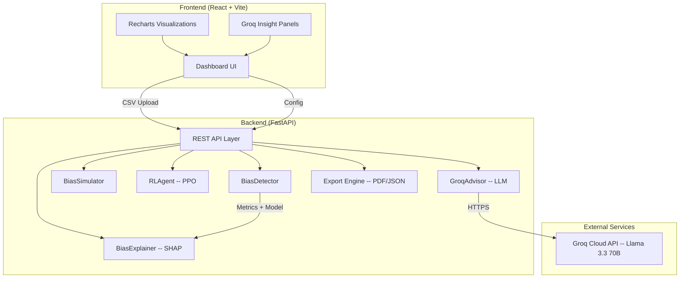
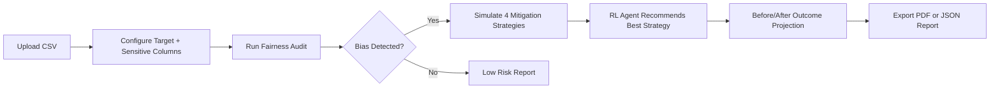
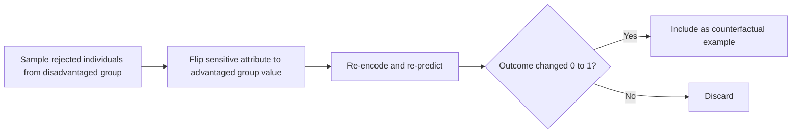
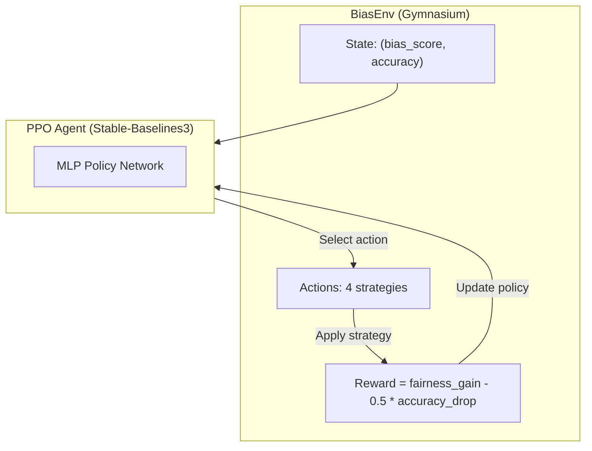

# EquiLens AI -- Neural Fairness Auditing and Mitigation Platform

> **Most tools detect bias. We fix it.**

EquiLens AI is a production-grade platform for detecting, explaining, and automatically mitigating algorithmic bias in machine learning models. It accepts **any tabular CSV dataset** -- not just the bundled demo -- and delivers a complete fairness audit pipeline: from data ingestion and intersectional analysis through SHAP explainability, counterfactual reasoning, and reinforcement-learning-driven strategy recommendation.

Built for the **Global AI Ethics Hackathon** problem statement:

> "Build a clear, accessible solution to thoroughly inspect data sets and software models for hidden unfairness or discrimination. Provide organizations with an easy way to measure, flag, and fix harmful bias before their systems impact real people."

---

## Table of Contents

1. [System Architecture](#system-architecture)
2. [Pipeline Workflow](#pipeline-workflow)
3. [Core Features in Detail](#core-features-in-detail)
4. [AI-Powered Narrative Layer (Groq LLM)](#ai-powered-narrative-layer-groq-llm)
5. [Tech Stack](#tech-stack)
6. [API Reference](#api-reference)
7. [Project Structure](#project-structure)
8. [Setup Instructions](#setup-instructions)
9. [Usage Examples](#usage-examples)
10. [Dataset Compatibility](#dataset-compatibility)

---

## System Architecture



---

## Pipeline Workflow



**Step-by-step breakdown:**

| Step | Action | Backend Endpoint | What Happens |
|------|--------|-----------------|--------------|
| 1 | Upload CSV or load demo | `GET /api/demo-dataset` | Parse headers, sanitize column names, populate dropdowns |
| 2 | Select target column (Y) and sensitive attribute (S) | -- | User picks from detected columns; auto-summaries appear |
| 3 | Run fairness audit | `POST /api/detect` | Train baseline model, compute 5 fairness metrics, SHAP, counterfactuals, intersectional analysis |
| 4 | Simulate strategies | `POST /api/simulate` | Run 4 mitigation strategies, compare fairness vs accuracy |
| 5 | Get RL recommendation | `POST /api/recommend` | PPO agent selects optimal strategy |
| 6 | Export report | `POST /api/export/pdf` or `/json` | Generate portable audit artifact |

---

## Core Features in Detail

### 1. Fairness Metrics Engine

Five industry-standard fairness metrics plus statistical significance testing:

| Metric | Formula | Interpretation |
|--------|---------|---------------|
| Demographic Parity Difference | max(approval_rate) - min(approval_rate) | Gap in positive outcome rates between groups |
| Equal Opportunity Difference | max(TPR) - min(TPR) | Gap in true positive rates between groups |
| Equalized Odds Difference | max(max(TPR_diff), max(FPR_diff)) | Worst-case gap across TPR and FPR |
| Average Odds Difference | 0.5 * (TPR_diff + FPR_diff) | Average gap across TPR and FPR |
| Disparate Impact Ratio | min(rate) / max(rate) | Follows the 80% Rule -- values below 0.8 indicate significant bias |

**Statistical significance** is computed via a Chi-squared test on the contingency table of sensitive attribute vs prediction. A p-value below 0.05 indicates the observed disparity is unlikely due to random chance.

**Example:** For a lending dataset with `sex` as the sensitive attribute, the audit might report:
- Demographic Parity Difference: 0.28 (Male approval 40%, Female approval 12%)
- Disparate Impact Ratio: 0.30 (well below the 0.8 threshold -- Critical bias)
- p-value: 0.0003 (statistically significant)

---

### 2. SHAP Explainability

Uses `shap.LinearExplainer` to decompose every prediction into per-feature contributions.

**Global SHAP:** Top-5 features ranked by mean absolute SHAP value across all samples. Identifies which features drive the model the most.

**Per-Group SHAP:** Separate SHAP rankings computed for each demographic group. Reveals whether the model relies on different features for different groups -- a sign of proxy discrimination.

**Example output:**
```
Global Top-5:
  1. capital-gain      0.0842
  2. education-num     0.0631
  3. hours-per-week    0.0523
  4. age               0.0412
  5. occupation_Sales  0.0298

Per-Group (Male):
  1. capital-gain      0.0921
  2. education-num     0.0710

Per-Group (Female):
  1. marital-status    0.0856   <-- proxy risk flagged
  2. capital-gain      0.0634
```

---

### 3. Counterfactual Explanations ("What If?")

Identifies real test-set individuals who were rejected by the model and shows how flipping only the sensitive attribute changes their outcome.

**How it works:**



Each example includes the top-5 SHAP feature values for interpretability. Up to 3 examples are returned.

**Example card:**
```
Individual #47:
  age: 34, education-num: 10, hours-per-week: 40
  Original: sex = Female -> REJECTED
  Counterfactual: sex = Male -> APPROVED
```

---

### 4. Intersectional Bias Analysis

Detects compound discrimination at the intersection of multiple sensitive attributes (e.g., sex + race).

- Computes positive prediction rates for every unique combination of values
- Filters out groups with fewer than 30 samples to avoid spurious results
- Visualized as a horizontal bar chart with disparity coloring

**Example:** For columns `sex` and `race`:
```
Female + Black:    8.2% approval   (42 samples)
Female + White:   14.1% approval   (67 samples)
Male + Black:     22.5% approval   (38 samples)
Male + White:     41.3% approval   (53 samples)
```

This reveals compound discrimination: Female + Black individuals face a 5x disadvantage compared to Male + White individuals.

---

### 5. Advanced Researcher Analytics

Deep performance audit with per-group diagnostic curves:

- **ROC Curves** -- Per-group Receiver Operating Characteristic curves plotted on the same axes to compare classifier performance across demographics
- **Precision-Recall Curves** -- Reveal performance differences in imbalanced group settings
- **Calibration Curves** -- Show whether predicted probabilities match actual outcome rates per group
- **Score Distribution Histograms** -- Visualize the spread of model confidence scores per group
- **Confusion Matrices** -- Per-group TP/TN/FP/FN counts displayed as interactive grids
- **Representation Audit** -- Horizontal bar chart showing percentage representation of each group in the dataset

---

### 6. Mitigation Strategy Simulation

Four automated strategies are tested in parallel:

| Strategy | Technique | How It Works |
|----------|-----------|-------------|
| Remove Sensitive Attribute | Pre-processing | Drops the sensitive column entirely. Simple but bias can persist through correlated proxy features |
| Reweight Dataset | Pre-processing | Assigns sample weights: W = P(S) * P(Y) / P(S,Y). Balances group representation during training |
| Threshold Adjustment | Post-processing | Sets different classification thresholds per group to equalize outcome rates |
| Fairness Constraint | In-processing | Uses strong L2 regularization (C=0.01) to reduce model reliance on discriminatory patterns |

Each strategy returns: accuracy, fairness score (1 - abs(DPD)), fairness gain, and accuracy drop relative to baseline.

**Visualization:** A Recharts scatter chart plots all 4 strategies plus the baseline on Accuracy (x-axis) vs Fairness (y-axis). The recommended strategy gets a pulsing dot animation. A shaded "target zone" marks the ideal quadrant.

---

### 7. Reinforcement Learning Recommender



- **Agent:** Proximal Policy Optimization (PPO), pre-trained for 10,000 timesteps
- **State space:** Continuous (bias_score, accuracy) in [0, 1]
- **Action space:** Discrete(4) -- one per mitigation strategy
- **Reward function:** `R = fairness_gain - 0.5 * accuracy_drop`
- **Production mode:** Loads from `ppo_bias_agent.zip` at startup; falls back to quick 500-step training if missing
- **Output:** Recommended strategy, expected gains, runner-up with reason for rejection, and all strategy scores

---

### 8. Before/After Outcome Projection

Side-by-side comparison cards showing the original model vs the optimized model after applying the recommended strategy:

- Model accuracy (large number)
- Fairness score (large number)
- Disparate impact with risk badge (Critical / High / Moderate / Low)
- Delta column with accuracy change, fairness change, and directional arrow
- Animated progress bar: "Bias reduced by X%" fills on scroll using IntersectionObserver

---

### 9. Audit Export and Reporting

| Format | Endpoint | Contents |
|--------|----------|----------|
| PDF | `POST /api/export/pdf` | Cover page, executive summary (AI narrative), bias metrics table, strategy comparison table, recommendation details, counterfactual examples, footer |
| JSON | `POST /api/export/json` | Machine-readable payload for downstream governance tooling and compliance automation |

PDF reports optionally include an AI-generated executive narrative via Groq LLM.

---

### 10. Client-Side Dataset Profiling

Before running the audit, the frontend computes a dataset profile entirely in the browser:

- **Summary row:** N rows, M columns, X% missing values
- **Sensitive attribute distribution:** SVG bar chart showing group percentages. Groups below 15% flagged as imbalanced
- **Target column positive rate:** Single bar showing outcome skew. Rates below 10% or above 90% flagged
- **Proxy feature detection:** Top-5 features correlated with the sensitive attribute via Pearson correlation, computed in-browser with no backend call

---

## AI-Powered Narrative Layer (Groq LLM)

EquiLens integrates Groq Cloud (Llama 3.3 70B Versatile) for five distinct AI insight panels:

| Panel | Endpoint | Purpose |
|-------|----------|---------|
| Executive Bias Narrative | `/api/groq/bias-narrative` | C-suite-ready explanation of fairness metrics in plain English |
| SHAP Proxy Risk Insight | `/api/groq/shap-insight` | Identifies which features likely proxy the sensitive attribute |
| Counterfactual Story Mode | `/api/groq/counterfactual-story` | Human-centered vignettes from affected individuals' perspective |
| Mitigation Advisor | `/api/groq/mitigation-advice` | Domain-aware action plan: immediate fix, 30-day plan, compliance, monitoring |
| Intersectional Compound Risk | `/api/groq/intersectional-insight` | Explains compound discrimination patterns for policy audiences |
| Full Audit Report Narrative | `/api/groq/full-report` | 500-700 word executive report with Overview, Findings, Risk, Actions, Compliance |

**Domain context:** Users select from General, Lending, Hiring, Healthcare, Insurance, or Education. The AI adapts recommendations to domain-specific regulations and risks.

**Graceful degradation:** All Groq features are additive. If the API key is missing or the service is unavailable, the core audit pipeline runs without interruption. The GroqAdvisor includes a TTL-based cache (300 seconds) to avoid redundant API calls.

---

## Tech Stack

### Backend (The Intelligence Layer)

| Component | Technology | Purpose |
|-----------|-----------|---------|
| Web Framework | FastAPI | Async REST API with automatic OpenAPI docs |
| ML Training | Scikit-learn (LogisticRegression) | Baseline model training and mitigation strategy execution |
| Explainability | SHAP (LinearExplainer) | Feature importance decomposition and proxy detection |
| RL Agent | Stable-Baselines3 + Gymnasium | PPO agent for strategy recommendation |
| Statistical Testing | SciPy (chi2_contingency) | P-value computation for fairness significance |
| Curve Analysis | Scikit-learn (roc_curve, precision_recall_curve, calibration_curve) | Per-group diagnostic curves |
| LLM Integration | Groq Cloud API via httpx | AI narrative generation (Llama 3.3 70B) |
| PDF Generation | ReportLab | Executive-ready audit reports |
| Data Processing | Pandas, NumPy | Data manipulation and numerical computation |

### Frontend (The Control Interface)

| Component | Technology | Purpose |
|-----------|-----------|---------|
| Framework | React 18 (Vite) | Fast SPA with hot module replacement |
| Styling | Tailwind CSS | Industrial dark theme with responsive design |
| Charts | Recharts | BarChart, ScatterChart, LineChart for all visualizations |
| File Handling | React Dropzone | Drag-and-drop CSV ingestion |
| AI Panels | GroqInsightPanel component | Collapsible, typewriter-animated AI insight cards |

---

## API Reference

| Method | Endpoint | Description |
|--------|----------|-------------|
| `GET` | `/health` | Health check |
| `GET` | `/api/demo-dataset` | Returns 500-row Adult Income sample with config |
| `POST` | `/api/detect` | Full fairness audit with SHAP, counterfactuals, intersectional analysis, advanced metrics |
| `POST` | `/api/simulate` | Run 4 mitigation strategies and compare trade-offs |
| `POST` | `/api/recommend` | RL-based strategy recommendation |
| `POST` | `/api/export/pdf` | Export audit report as PDF |
| `POST` | `/api/export/json` | Export audit report as JSON |
| `POST` | `/api/groq/bias-narrative` | AI-generated bias explanation |
| `POST` | `/api/groq/shap-insight` | AI-generated SHAP proxy analysis |
| `POST` | `/api/groq/counterfactual-story` | AI-generated counterfactual vignettes |
| `POST` | `/api/groq/mitigation-advice` | Domain-aware mitigation plan |
| `POST` | `/api/groq/intersectional-insight` | Compound discrimination explanation |
| `POST` | `/api/groq/full-report` | Complete executive narrative |

### POST /api/detect Parameters

| Parameter | Type | Required | Description |
|-----------|------|----------|-------------|
| `file` | UploadFile | Yes | Any CSV dataset |
| `target_col` | string | Yes | Binary target column name |
| `sensitive_col` | string | Yes | Primary sensitive attribute |
| `intersectional_cols` | string | No | Comma-separated columns for intersectional analysis |

---

## Project Structure

```
biasguard-ai/
    backend/
        main.py                      FastAPI app entry point
        requirements.txt             Python dependencies
        .env                         GROQ_API_KEY configuration
        ppo_bias_agent.zip           Pre-trained RL model (generated)
        data/
            adult_sample.csv         Bundled 500-row demo dataset
        routers/
            bias.py                  /api/detect endpoint
            simulate.py              /api/simulate endpoint
            recommend.py             /api/recommend endpoint
            demo.py                  /api/demo-dataset endpoint
            export.py                /api/export/pdf and /json endpoints
            groq_insights.py         /api/groq/* endpoints (5 AI panels)
        services/
            detector.py              BiasDetector: metrics, counterfactuals, intersectional, advanced curves
            explainer.py             BiasExplainer: global + per-group SHAP
            simulator.py             4 mitigation strategy implementations
            rl_agent.py              PPO agent + BiasEnv (Gymnasium)
            groq_advisor.py          Groq LLM integration with caching
        models/
            schemas.py               Pydantic request/response models
        scripts/
            pretrain_agent.py        Pre-train PPO agent (10k steps)
            smoke_test.py            End-to-end pipeline validation
    frontend/
        src/
            App.jsx                  Main dashboard: state, handlers, all UI sections
            index.css                Industrial dark theme styles
            components/
                GroqInsightPanel.jsx  Collapsible AI insight panel with typewriter animation
        package.json
        tailwind.config.js
        vite.config.js
        public/
            favicon.svg              Custom shield favicon
```

---

## Setup Instructions

### Prerequisites

- Python 3.9 or higher
- Node.js 18 or higher
- (Optional) Groq API key for AI narrative features

### Backend

```bash
cd biasguard-ai/backend

pip install -r requirements.txt

# Configure Groq (optional -- platform works without it)
echo "GROQ_API_KEY=your_key_here" > .env

# Pre-train the RL agent (recommended before demos)
python scripts/pretrain_agent.py

# Start the API server
uvicorn main:app --reload --port 8000
```

### Frontend

```bash
cd biasguard-ai/frontend
npm install
npm run dev
```

The frontend runs on `http://localhost:5173` and the backend on `http://localhost:8000`.

### Smoke Test

```bash
cd biasguard-ai/backend
python scripts/smoke_test.py
```

Expected output:
```
  /api/detect                      0.07s   PASS
  /api/simulate                    0.19s   PASS
  /api/recommend                   0.00s   PASS
  fairness check                   0.00s   PASS

  Total pipeline time              0.27s

  ALL CHECKS PASSED
```

---

## Usage Examples

### Example 1: Lending Bias Audit

Upload a loan approval dataset with columns like `approved`, `gender`, `income`, `credit_score`, `zip_code`.

1. Set Target Column to `approved`
2. Set Sensitive Attribute to `gender`
3. Set Domain Context to `Lending`
4. Run Fairness Audit

The system will:
- Train a baseline model and compute approval rates per gender
- Flag if `zip_code` acts as a proxy for race (via SHAP)
- Show counterfactual examples: "This female applicant with identical qualifications would have been approved if male"
- Simulate 4 mitigation strategies and recommend the best one
- Generate AI advice referencing lending-specific regulations (ECOA, Fair Lending Act)

### Example 2: Hiring Resume Screening

Upload a hiring dataset with columns like `hired`, `race`, `education`, `years_experience`, `university`.

1. Set Target Column to `hired`
2. Set Sensitive Attribute to `race`
3. Add `gender` as an intersectional column
4. Run Fairness Audit

The intersectional analysis will reveal compound discrimination (e.g., Black + Female candidates face the lowest hiring rates). The SHAP analysis may flag `university` as a proxy for socioeconomic status.

### Example 3: Healthcare Diagnostic Equity

Upload a diagnostic dataset with columns like `diagnosed`, `ethnicity`, `age`, `insurance_type`, `symptom_count`.

1. Set Target Column to `diagnosed`
2. Set Sensitive Attribute to `ethnicity`
3. Set Domain Context to `Healthcare`

The system flags if certain ethnic groups receive lower diagnostic rates even with similar symptom profiles. The AI mitigation advisor will reference healthcare equity standards.

---

## Dataset Compatibility

EquiLens works with **any tabular CSV dataset** that has:

- A **binary target column** (0/1, yes/no, true/false, or categorical like ">50K")
- At least one **sensitive attribute column** (any categorical column representing a demographic feature)

The system automatically:
- Dummy-encodes all categorical features
- Handles missing values gracefully
- Sanitizes column names (strips whitespace and quotes)
- Detects group imbalances and warns when minority groups have less than 15% representation

**Tested dataset types:** Adult Income, COMPAS recidivism, German Credit, custom HR datasets, medical diagnosis records, insurance claim data, and university admissions data.

---

## Design Decisions

| Decision | Rationale |
|----------|-----------|
| Logistic Regression as baseline | Interpretable, fast, and compatible with SHAP LinearExplainer. Sufficient to demonstrate bias patterns without introducing model complexity as a confound |
| Client-side Pearson correlation | Reduces backend latency and server load. Correlation computation is lightweight enough for browser execution on datasets up to ~10k rows |
| Groq as additive layer | All AI features degrade gracefully. The core audit pipeline never depends on external API availability |
| PPO with simulated outcomes | Enables pre-training without requiring the user's actual dataset. The agent learns general fairness-accuracy trade-off preferences |
| Chi-squared significance test | Standard statistical test for categorical independence. Provides p-values that are directly interpretable by compliance teams |

---

Built by the EquiLens team for the Global AI Ethics Hackathon.

**Accuracy without Fairness is an Error.**
